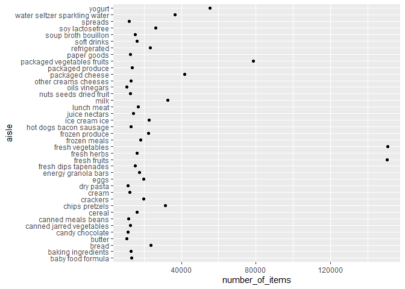
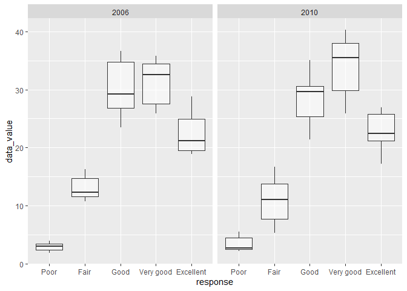
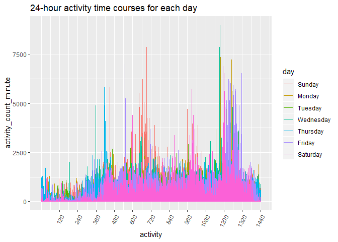

p8105\_hw3\_xl2851
================

# problem 1

## 1.1 How many aisles are there, and which aisles are the most items ordered from?

``` r
library(p8105.datasets)
library(tidyr)
library(tidyverse)
```

    ## -- Attaching packages -------------------

    ## v ggplot2 3.2.1     v purrr   0.3.2
    ## v tibble  2.1.3     v dplyr   0.8.3
    ## v readr   1.3.1     v stringr 1.4.0
    ## v ggplot2 3.2.1     v forcats 0.4.0

    ## -- Conflicts --- tidyverse_conflicts() --
    ## x dplyr::filter() masks stats::filter()
    ## x dplyr::lag()    masks stats::lag()

``` r
data("instacart")
```

``` r
aisle_count=
instacart %>%
  group_by(aisle) %>%
  summarize(number_of_items=n())%>%
  arrange(desc(number_of_items))
```

There are 134 aisles. Fresh vegetables are the most items ordered
from.

## 1.2 Make a plot that shows the number of items ordered in each aisle, limiting this to aisles with more than 10000 items ordered.

``` r
plot_aisle =
  aisle_count %>%
  filter(number_of_items>10000)%>%
  ggplot(aes(x=number_of_items, y=aisle))+
   labs(
    title = "Aisles plot",
    x = "names of aisles",
    y = "number of items ordered in each aisle",
    caption = "Data from instacart")

plot_aisle+geom_point()
```

<!-- -->

## 1.3 Make a table showing the three most popular items in each of the aisles

``` r
  instacart %>%
  filter(aisle == c("baking ingredients","dog food care","packaged vegetables fruits"))%>%
  group_by(aisle)%>%
  count(product_name, name="num_of_items")%>%
  arrange(desc(num_of_items))%>%
  top_n(3)%>%
  knitr::kable()
```

    ## Selecting by num_of_items

| aisle                      | product\_name                                   | num\_of\_items |
| :------------------------- | :---------------------------------------------- | -------------: |
| packaged vegetables fruits | Organic Baby Spinach                            |           3324 |
| packaged vegetables fruits | Organic Raspberries                             |           1920 |
| packaged vegetables fruits | Organic Blueberries                             |           1692 |
| baking ingredients         | Light Brown Sugar                               |            157 |
| baking ingredients         | Pure Baking Soda                                |            140 |
| baking ingredients         | Organic Vanilla Extract                         |            122 |
| dog food care              | Organix Grain Free Chicken & Vegetable Dog Food |             14 |
| dog food care              | Organix Chicken & Brown Rice Recipe             |             13 |
| dog food care              | Original Dry Dog                                |              9 |

## 1.4 Make a table showing the mean hour of the day at which Pink Lady Apples and Coffee Ice Cream are ordered on each day of the week

``` r
  instacart %>%
  filter(product_name==c("Pink Lady Apples","Coffee Ice Cream"))%>%
  group_by(order_dow)%>%
  summarize(
    mean=mean(order_hour_of_day)
  )%>%
  knitr::kable(digits=1)
```

    ## Warning in product_name == c("Pink Lady Apples", "Coffee Ice Cream"):
    ## longer object length is not a multiple of shorter object length

| order\_dow | mean |
| ---------: | ---: |
|          0 | 12.8 |
|          1 | 12.7 |
|          2 | 12.9 |
|          3 | 14.5 |
|          4 | 13.6 |
|          5 | 12.9 |
|          6 | 12.1 |

According to the table, the lastest mean onder hour(14.5) is on
Wednesday.

There are 1384617 rows and 15 columns in data ‘instacart’. There are 134
distinct aisles. Some key variables include (add later)

# problem 2

## clean the data

``` r
data("brfss_smart2010")
tidied_brfss=
  filter(brfss_smart2010,Topic=="Overall Health")%>%
  janitor::clean_names() %>%
  rename(state = "locationabbr", location = "locationdesc")%>%
  mutate(
    response=as.factor(response),
    response = forcats::fct_relevel(response, c("Poor","Fair","Good", "Very good","Excellent")))
```

## In 2002, which states were observed at 7 or more locations? What about in 2010?

``` r
  tidied_brfss%>%
  group_by(state,year)%>%
  summarise(n_location=n_distinct(location, na.rm = FALSE))%>%
  filter(n_location>=7, year==2002)%>%
  knitr::kable()
```

| state | year | n\_location |
| :---- | ---: | ----------: |
| CT    | 2002 |           7 |
| FL    | 2002 |           7 |
| MA    | 2002 |           8 |
| NC    | 2002 |           7 |
| NJ    | 2002 |           8 |
| PA    | 2002 |          10 |

``` r
  tidied_brfss%>%
  group_by(state,year)%>%
  summarise(n_location=n_distinct(location, na.rm = FALSE))%>%
  filter(n_location>=7, year==2010)%>%
  knitr::kable()
```

| state | year | n\_location |
| :---- | ---: | ----------: |
| CA    | 2010 |          12 |
| CO    | 2010 |           7 |
| FL    | 2010 |          41 |
| MA    | 2010 |           9 |
| MD    | 2010 |          12 |
| NC    | 2010 |          12 |
| NE    | 2010 |          10 |
| NJ    | 2010 |          19 |
| NY    | 2010 |           9 |
| OH    | 2010 |           8 |
| PA    | 2010 |           7 |
| SC    | 2010 |           7 |
| TX    | 2010 |          16 |
| WA    | 2010 |          10 |

According to the table, in 2002, CT, FL, MA, NC, NJ and PA were observed
at 7 or more locations. In 2010, CA, CO, FL, MA, MD, NC, NE, NJ, NY, OH,
PA, SC, TX and WA were observed at 7 or more
locations.

## Construct a dataset that is limited to Excellent responses, and contains, year, state, and a variable that averages the data\_value across locations within a state.

``` r
brfss_new =
  tidied_brfss %>% 
  filter(response == "Excellent") %>% 
  group_by(year, location) %>% 
  mutate(mean = mean(data_value, na.rm = FALSE)) %>%
  select(year, location, mean) %>% 
  distinct() 
```

## Make a “spaghetti” plot

``` r
ggplot(brfss_new, aes(x = year, y = mean, color = location, group = location))+
  geom_line() +
  theme(legend.position="none") +
  xlab("Year") +
  ylab("Mean value") +
  ggtitle("The average value over time within a state")
```

    ## Warning: Removed 5 rows containing missing values (geom_path).

<!-- -->

The plots shows the average data\_value across location within a state
with “year” as the x-axis and “mean value” as the y-axis.

## two-panel plot

``` r
  tidied_brfss %>%
  filter(state=="NY",year %in% c(2006, 2010))%>%
  ggplot(aes(x = response, y = data_value, color=response)) +
  geom_boxplot(alpha = .5)+
  facet_grid(~year)+
  theme(text = element_text(size=12),
         axis.text.x = element_text(angle=90, vjust=0.5)) +
  labs(
    title = "Distribution of data_value for responses among locations in NY State",
    x = "Response",
    y = "data_value")
```

<!-- -->

The two-panel plot shows for the years 2006, and 2010, distribution of
data\_value for responses (“Poor” to “Excellent”) among locations in NY
State. Within these 2 years, the distribution of response is similar but
in 2010 there were more “very good” responses.

# problem 3

``` r
accel_data=read_csv("./accel_data.csv")%>%
   janitor::clean_names() %>%
  mutate(
    type = case_when(
      day %in% c("Saturday", "Sunday") ~ "weekend",
      day %in% c("Monday", "Tuesday", "Wednesday", "Thursday", "Friday") ~ "weekday", TRUE~""),
    day = as.factor(day),
    day = forcats::fct_relevel(day, c("Sunday","Monday","Tuesday","Wednesday","Thursday", "Friday", "Saturday"))) %>% 
  pivot_longer(
    activity_1:activity_1440,
    names_to = "activity",
    names_prefix = "activity_",
    values_to = "count"
  )
```

    ## Parsed with column specification:
    ## cols(
    ##   .default = col_double(),
    ##   day = col_character()
    ## )

    ## See spec(...) for full column specifications.

The dataset, “accel\_data”, has 50400 observations and 6 variables. Key
variables are week, type, day activity and
count.

## aggregate accross minutes to create a total activity variable for each day

``` r
accel_data %>% 
  group_by(week,day, day_id) %>%
  summarize(activity_total = sum(count)) %>% 
  knitr::kable()
```

| week | day       | day\_id | activity\_total |
| ---: | :-------- | ------: | --------------: |
|    1 | Sunday    |       4 |       631105.00 |
|    1 | Monday    |       2 |        78828.07 |
|    1 | Tuesday   |       6 |       307094.24 |
|    1 | Wednesday |       7 |       340115.01 |
|    1 | Thursday  |       5 |       355923.64 |
|    1 | Friday    |       1 |       480542.62 |
|    1 | Saturday  |       3 |       376254.00 |
|    2 | Sunday    |      11 |       422018.00 |
|    2 | Monday    |       9 |       295431.00 |
|    2 | Tuesday   |      13 |       423245.00 |
|    2 | Wednesday |      14 |       440962.00 |
|    2 | Thursday  |      12 |       474048.00 |
|    2 | Friday    |       8 |       568839.00 |
|    2 | Saturday  |      10 |       607175.00 |
|    3 | Sunday    |      18 |       467052.00 |
|    3 | Monday    |      16 |       685910.00 |
|    3 | Tuesday   |      20 |       381507.00 |
|    3 | Wednesday |      21 |       468869.00 |
|    3 | Thursday  |      19 |       371230.00 |
|    3 | Friday    |      15 |       467420.00 |
|    3 | Saturday  |      17 |       382928.00 |
|    4 | Sunday    |      25 |       260617.00 |
|    4 | Monday    |      23 |       409450.00 |
|    4 | Tuesday   |      27 |       319568.00 |
|    4 | Wednesday |      28 |       434460.00 |
|    4 | Thursday  |      26 |       340291.00 |
|    4 | Friday    |      22 |       154049.00 |
|    4 | Saturday  |      24 |         1440.00 |
|    5 | Sunday    |      32 |       138421.00 |
|    5 | Monday    |      30 |       389080.00 |
|    5 | Tuesday   |      34 |       367824.00 |
|    5 | Wednesday |      35 |       445366.00 |
|    5 | Thursday  |      33 |       549658.00 |
|    5 | Friday    |      29 |       620860.00 |
|    5 | Saturday  |      31 |         1440.00 |

I did not see any apparent
trends.

## Make a single-panel plot that shows the 24-hour activity time courses for each day

``` r
  accel_data %>% 
  group_by(week,day, day_id) %>%
  summarize(activity_total = sum(count))%>%
  rowid_to_column("ID")%>%
    ggplot(aes(x = ID, y = activity_total)) +
    geom_point(aes(color = day), alpha = .5) +
    geom_smooth(se = FALSE)+
labs(
    title = "24-hour activity time courses for each day",
    x = "ID",
    y = "activity_total")
```

    ## `geom_smooth()` using method = 'loess' and formula 'y ~ x'

<!-- -->
