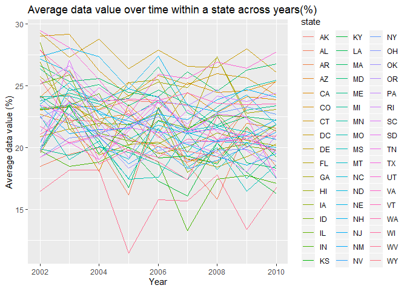

p8105\_hw3\_xl2851
================

# problem 1

## 1.1 How many aisles are there, and which aisles are the most items ordered from?

``` r
library(p8105.datasets)
library(tidyr)
library(tidyverse)
```

    ## -- Attaching packages -------------------

    ## v ggplot2 3.2.1     v purrr   0.3.2
    ## v tibble  2.1.3     v dplyr   0.8.3
    ## v readr   1.3.1     v stringr 1.4.0
    ## v ggplot2 3.2.1     v forcats 0.4.0

    ## -- Conflicts --- tidyverse_conflicts() --
    ## x dplyr::filter() masks stats::filter()
    ## x dplyr::lag()    masks stats::lag()

``` r
library(ggridges)
```

    ## 
    ## Attaching package: 'ggridges'

    ## The following object is masked from 'package:ggplot2':
    ## 
    ##     scale_discrete_manual

``` r
data("instacart")
```

``` r
aisle_count=
instacart %>%
  group_by(aisle) %>%
  summarize(number_of_items=n())%>%
  arrange(desc(number_of_items))
```

There are 134 distinct aisles. Fresh vegetables are the most items
ordered
from.

## 1.2 Make a plot that shows the number of items ordered in each aisle, limiting this to aisles with more than 10000 items ordered.

``` r
  aisle_count %>%
  filter(number_of_items>10000)%>%
  ggplot(aes(x=number_of_items, y=aisle))+
  geom_point(alpha=0.6)
```

<!-- -->

``` r
   labs(
    title = "number of items ordered in each aisle",
    x = "names of aisles",
    y = "number of items",
    caption = "Data from instacart")+
theme(axis.text.y = element_text(angle = 0, hjust = 1))
```

    ## NULL

## 1.3 Make a table showing the three most popular items in each of the aisles

``` r
  popular_product=
  instacart %>%
  filter(aisle == c("baking ingredients","dog food care","packaged vegetables fruits"))%>%
  group_by(aisle)%>%
  count(product_name, name="num_of_items")%>%
  arrange(desc(num_of_items))%>%
  top_n(3)
```

    ## Selecting by num_of_items

``` r
    knitr::kable(popular_product,
               col.names = c("Aisle", "Most Popular Items", "Number of Items"),
               format = "html",
               caption = "The 3 most popular items in each of the 3 aisles"
               )
```

<table>

<caption>

The 3 most popular items in each of the 3 aisles

</caption>

<thead>

<tr>

<th style="text-align:left;">

Aisle

</th>

<th style="text-align:left;">

Most Popular Items

</th>

<th style="text-align:right;">

Number of Items

</th>

</tr>

</thead>

<tbody>

<tr>

<td style="text-align:left;">

packaged vegetables fruits

</td>

<td style="text-align:left;">

Organic Baby Spinach

</td>

<td style="text-align:right;">

3324

</td>

</tr>

<tr>

<td style="text-align:left;">

packaged vegetables fruits

</td>

<td style="text-align:left;">

Organic Raspberries

</td>

<td style="text-align:right;">

1920

</td>

</tr>

<tr>

<td style="text-align:left;">

packaged vegetables fruits

</td>

<td style="text-align:left;">

Organic Blueberries

</td>

<td style="text-align:right;">

1692

</td>

</tr>

<tr>

<td style="text-align:left;">

baking ingredients

</td>

<td style="text-align:left;">

Light Brown Sugar

</td>

<td style="text-align:right;">

157

</td>

</tr>

<tr>

<td style="text-align:left;">

baking ingredients

</td>

<td style="text-align:left;">

Pure Baking Soda

</td>

<td style="text-align:right;">

140

</td>

</tr>

<tr>

<td style="text-align:left;">

baking ingredients

</td>

<td style="text-align:left;">

Organic Vanilla Extract

</td>

<td style="text-align:right;">

122

</td>

</tr>

<tr>

<td style="text-align:left;">

dog food care

</td>

<td style="text-align:left;">

Organix Grain Free Chicken & Vegetable Dog Food

</td>

<td style="text-align:right;">

14

</td>

</tr>

<tr>

<td style="text-align:left;">

dog food care

</td>

<td style="text-align:left;">

Organix Chicken & Brown Rice Recipe

</td>

<td style="text-align:right;">

13

</td>

</tr>

<tr>

<td style="text-align:left;">

dog food care

</td>

<td style="text-align:left;">

Original Dry
Dog

</td>

<td style="text-align:right;">

9

</td>

</tr>

</tbody>

</table>

## 1.4 Make a table showing the mean hour of the day at which Pink Lady Apples and Coffee Ice Cream are ordered on each day of the week

``` r
mean_hour = instacart %>% 
   filter(product_name %in% c("Pink Lady Apples", "Coffee Ice Cream")) %>% 
  group_by(product_name, order_dow) %>%
  summarize(mean_hour_of_day = mean(order_hour_of_day)) %>%
  pivot_wider(
    names_from = "order_dow",
    values_from = "mean_hour_of_day"
  )
knitr::kable(mean_hour, 
             format = "html",
             caption = "The mean hour of the day at which Pink Lady Apples and Coffee Ice Cream are ordered on each day of the week",
             col.names = c("Product Name", "Sunday", "Monday","Tuesday","Wednesday","Thursday","Friday","Saturday"),
             digits = 1)
```

<table>

<caption>

The mean hour of the day at which Pink Lady Apples and Coffee Ice Cream
are ordered on each day of the week

</caption>

<thead>

<tr>

<th style="text-align:left;">

Product Name

</th>

<th style="text-align:right;">

Sunday

</th>

<th style="text-align:right;">

Monday

</th>

<th style="text-align:right;">

Tuesday

</th>

<th style="text-align:right;">

Wednesday

</th>

<th style="text-align:right;">

Thursday

</th>

<th style="text-align:right;">

Friday

</th>

<th style="text-align:right;">

Saturday

</th>

</tr>

</thead>

<tbody>

<tr>

<td style="text-align:left;">

Coffee Ice Cream

</td>

<td style="text-align:right;">

13.8

</td>

<td style="text-align:right;">

14.3

</td>

<td style="text-align:right;">

15.4

</td>

<td style="text-align:right;">

15.3

</td>

<td style="text-align:right;">

15.2

</td>

<td style="text-align:right;">

12.3

</td>

<td style="text-align:right;">

13.8

</td>

</tr>

<tr>

<td style="text-align:left;">

Pink Lady Apples

</td>

<td style="text-align:right;">

13.4

</td>

<td style="text-align:right;">

11.4

</td>

<td style="text-align:right;">

11.7

</td>

<td style="text-align:right;">

14.2

</td>

<td style="text-align:right;">

11.6

</td>

<td style="text-align:right;">

12.8

</td>

<td style="text-align:right;">

11.9

</td>

</tr>

</tbody>

</table>

According to the table, the mean order hour of Coffee Ice Cream on
Tuesday is the latest (15.4) and the mean order hour of Pink Lady Apples
on Wednesday is the latest (14.2).

There are 1384617 rows and 15 columns in data ‘instacart’.

Each row in the dataset is a product from an order. There is a single
order per user in this dataset.

Some key variables include:

order\_dow: the day of the week on which the order was placed

order\_hour\_of\_day: the hour of the day on which the order was placed

days\_since\_prior\_order: days since the last order, capped at 30, NA
if order\_number=1

product\_name: name of the product

aisle: the name of the aisle

department: the name of the department

Take the first observation as an example: Customer with user\_id
“112108” ordered Bulgarian Yogurt(product ID 49302) from yogurt
aisle in dairy eggs department on Thursday 10am, 9 days after his/her
last order. This order belongs to the train evaluation set.

# problem 2

## clean the data

``` r
data("brfss_smart2010")

tidied_brfss = 
  brfss_smart2010 %>% 
  janitor::clean_names() %>%
  rename(state = "locationabbr", location = "locationdesc") %>% 
  filter(topic == "Overall Health") %>%  
  filter(response %in% c("Excellent", "Very good", "Good", "Fair", "Poor")) %>%
  mutate(response = as.factor(response),
         response = forcats::fct_relevel(response, c("Poor","Fair","Good", "Very good","Excellent")))
```

## In 2002, which states were observed at 7 or more locations? What about in 2010?

``` r
  obs_state_2002=
  tidied_brfss%>%
  filter(year==2002)%>%
  group_by(state)%>%
  summarise(n_location=n_distinct(location, na.rm = FALSE))%>%
  filter(n_location>=7)
  knitr::kable(obs_state_2002,
             col.names = c("State", "Number of observed Locations"),
             format = "html",
             caption = "The states that were observed at 7 or more locations in 2002")
```

<table>

<caption>

The states that were observed at 7 or more locations in 2002

</caption>

<thead>

<tr>

<th style="text-align:left;">

State

</th>

<th style="text-align:right;">

Number of observed Locations

</th>

</tr>

</thead>

<tbody>

<tr>

<td style="text-align:left;">

CT

</td>

<td style="text-align:right;">

7

</td>

</tr>

<tr>

<td style="text-align:left;">

FL

</td>

<td style="text-align:right;">

7

</td>

</tr>

<tr>

<td style="text-align:left;">

MA

</td>

<td style="text-align:right;">

8

</td>

</tr>

<tr>

<td style="text-align:left;">

NC

</td>

<td style="text-align:right;">

7

</td>

</tr>

<tr>

<td style="text-align:left;">

NJ

</td>

<td style="text-align:right;">

8

</td>

</tr>

<tr>

<td style="text-align:left;">

PA

</td>

<td style="text-align:right;">

10

</td>

</tr>

</tbody>

</table>

``` r
obs_state_2010=
  tidied_brfss%>%
  filter(year==2010)%>%
  group_by(state)%>%
  summarise(n_location=n_distinct(location, na.rm = FALSE))%>%
  filter(n_location>=7)
  knitr::kable(obs_state_2010,
             col.names = c("State", "Number of observed Locations"),
             format = "html",
             caption = "The states that were observed at 7 or more locations in 2010")
```

<table>

<caption>

The states that were observed at 7 or more locations in 2010

</caption>

<thead>

<tr>

<th style="text-align:left;">

State

</th>

<th style="text-align:right;">

Number of observed Locations

</th>

</tr>

</thead>

<tbody>

<tr>

<td style="text-align:left;">

CA

</td>

<td style="text-align:right;">

12

</td>

</tr>

<tr>

<td style="text-align:left;">

CO

</td>

<td style="text-align:right;">

7

</td>

</tr>

<tr>

<td style="text-align:left;">

FL

</td>

<td style="text-align:right;">

41

</td>

</tr>

<tr>

<td style="text-align:left;">

MA

</td>

<td style="text-align:right;">

9

</td>

</tr>

<tr>

<td style="text-align:left;">

MD

</td>

<td style="text-align:right;">

12

</td>

</tr>

<tr>

<td style="text-align:left;">

NC

</td>

<td style="text-align:right;">

12

</td>

</tr>

<tr>

<td style="text-align:left;">

NE

</td>

<td style="text-align:right;">

10

</td>

</tr>

<tr>

<td style="text-align:left;">

NJ

</td>

<td style="text-align:right;">

19

</td>

</tr>

<tr>

<td style="text-align:left;">

NY

</td>

<td style="text-align:right;">

9

</td>

</tr>

<tr>

<td style="text-align:left;">

OH

</td>

<td style="text-align:right;">

8

</td>

</tr>

<tr>

<td style="text-align:left;">

PA

</td>

<td style="text-align:right;">

7

</td>

</tr>

<tr>

<td style="text-align:left;">

SC

</td>

<td style="text-align:right;">

7

</td>

</tr>

<tr>

<td style="text-align:left;">

TX

</td>

<td style="text-align:right;">

16

</td>

</tr>

<tr>

<td style="text-align:left;">

WA

</td>

<td style="text-align:right;">

10

</td>

</tr>

</tbody>

</table>

According to the table, in 2002, 6 states(CT, FL, MA, NC, NJ and PA)
were observed at 7 or more locations. In 2010, 14 states(CA, CO, FL, MA,
MD, NC, NE, NJ, NY, OH, PA, SC, TX and WA) were observed at 7 or more
locations.

## Construct a dataset that is limited to Excellent responses, and contains, year, state, and a variable that averages the data\_value across locations within a state.

``` r
brfss_new =
  tidied_brfss %>% 
  filter(response == "Excellent") %>% 
  group_by(year, location) %>% 
  mutate(mean = mean(data_value, na.rm = FALSE)) %>%
  select(year, location, mean) %>% 
  distinct() 
```

## Make a “spaghetti” plot

``` r
ggplot(brfss_new, aes(x = year, y = mean, color = location, group = location))+
  geom_line() +
  theme(legend.position="none") +
  xlab("Year") +
  ylab("Mean value") +
  ggtitle("The average value over time within a state")
```

    ## Warning: Removed 5 rows containing missing values (geom_path).

<!-- -->

The plots shows the average data\_value across location within a state
with “year” as the x-axis and “mean value” as the y-axis.

## two-panel plot

``` r
 tidied_brfss %>%
  filter(state=="NY",year %in% c(2006, 2010))%>%
ggplot(aes(fill= response, y=data_value, x=location)) +
  geom_bar(position = "fill",stat = "identity")+
  facet_grid(.~year) +
  coord_flip() +
  labs(
        title = "distribution of data_value for responses",
        y = "Average data_value",
        x = "response",
        caption = "Data from p8105.datasets package") +
  theme(legend.position = "bottom")
```

<!-- -->

The two-panel plot shows for the years 2006, and 2010, distribution of
data\_value for responses (“Poor” to “Excellent”) among locations in NY
State. Within these 2 years, the distribution of response is similar but
in 2010 there were more “very good” responses.

# problem 3

``` r
accel_data=read_csv("./data/accel_data.csv")%>%
   janitor::clean_names() %>%
    pivot_longer(
    activity_1:activity_1440,
    names_to = "activity",
    names_prefix = "activity_",
    values_to = "count")%>%
    mutate(
    activity=as.numeric(activity),
    day_type = case_when(
      day %in% c("Saturday", "Sunday") ~ "weekend",
      day %in% c("Monday", "Tuesday", "Wednesday", "Thursday", "Friday") ~ "weekday", TRUE~""),
    day = as.factor(day),
    day = forcats::fct_relevel(day, c("Sunday","Monday","Tuesday","Wednesday","Thursday", "Friday", "Saturday")))  
```

    ## Parsed with column specification:
    ## cols(
    ##   .default = col_double(),
    ##   day = col_character()
    ## )

    ## See spec(...) for full column specifications.

The dataset, “accel\_data”, has 50400 observations and 6 variables. Key
variables are week, day\_type, day, activity and
count.

## aggregate accross minutes to create a total activity variable for each day

``` r
day_activity=
accel_data %>% 
  group_by(week,day) %>%
  summarize(activity_total = sum(count)) 
  knitr::kable(day_activity,
               format = "html",
             caption = "Total activity counts for each day",
             digits = 0)
```

<table>

<caption>

Total activity counts for each day

</caption>

<thead>

<tr>

<th style="text-align:right;">

week

</th>

<th style="text-align:left;">

day

</th>

<th style="text-align:right;">

activity\_total

</th>

</tr>

</thead>

<tbody>

<tr>

<td style="text-align:right;">

1

</td>

<td style="text-align:left;">

Sunday

</td>

<td style="text-align:right;">

631105

</td>

</tr>

<tr>

<td style="text-align:right;">

1

</td>

<td style="text-align:left;">

Monday

</td>

<td style="text-align:right;">

78828

</td>

</tr>

<tr>

<td style="text-align:right;">

1

</td>

<td style="text-align:left;">

Tuesday

</td>

<td style="text-align:right;">

307094

</td>

</tr>

<tr>

<td style="text-align:right;">

1

</td>

<td style="text-align:left;">

Wednesday

</td>

<td style="text-align:right;">

340115

</td>

</tr>

<tr>

<td style="text-align:right;">

1

</td>

<td style="text-align:left;">

Thursday

</td>

<td style="text-align:right;">

355924

</td>

</tr>

<tr>

<td style="text-align:right;">

1

</td>

<td style="text-align:left;">

Friday

</td>

<td style="text-align:right;">

480543

</td>

</tr>

<tr>

<td style="text-align:right;">

1

</td>

<td style="text-align:left;">

Saturday

</td>

<td style="text-align:right;">

376254

</td>

</tr>

<tr>

<td style="text-align:right;">

2

</td>

<td style="text-align:left;">

Sunday

</td>

<td style="text-align:right;">

422018

</td>

</tr>

<tr>

<td style="text-align:right;">

2

</td>

<td style="text-align:left;">

Monday

</td>

<td style="text-align:right;">

295431

</td>

</tr>

<tr>

<td style="text-align:right;">

2

</td>

<td style="text-align:left;">

Tuesday

</td>

<td style="text-align:right;">

423245

</td>

</tr>

<tr>

<td style="text-align:right;">

2

</td>

<td style="text-align:left;">

Wednesday

</td>

<td style="text-align:right;">

440962

</td>

</tr>

<tr>

<td style="text-align:right;">

2

</td>

<td style="text-align:left;">

Thursday

</td>

<td style="text-align:right;">

474048

</td>

</tr>

<tr>

<td style="text-align:right;">

2

</td>

<td style="text-align:left;">

Friday

</td>

<td style="text-align:right;">

568839

</td>

</tr>

<tr>

<td style="text-align:right;">

2

</td>

<td style="text-align:left;">

Saturday

</td>

<td style="text-align:right;">

607175

</td>

</tr>

<tr>

<td style="text-align:right;">

3

</td>

<td style="text-align:left;">

Sunday

</td>

<td style="text-align:right;">

467052

</td>

</tr>

<tr>

<td style="text-align:right;">

3

</td>

<td style="text-align:left;">

Monday

</td>

<td style="text-align:right;">

685910

</td>

</tr>

<tr>

<td style="text-align:right;">

3

</td>

<td style="text-align:left;">

Tuesday

</td>

<td style="text-align:right;">

381507

</td>

</tr>

<tr>

<td style="text-align:right;">

3

</td>

<td style="text-align:left;">

Wednesday

</td>

<td style="text-align:right;">

468869

</td>

</tr>

<tr>

<td style="text-align:right;">

3

</td>

<td style="text-align:left;">

Thursday

</td>

<td style="text-align:right;">

371230

</td>

</tr>

<tr>

<td style="text-align:right;">

3

</td>

<td style="text-align:left;">

Friday

</td>

<td style="text-align:right;">

467420

</td>

</tr>

<tr>

<td style="text-align:right;">

3

</td>

<td style="text-align:left;">

Saturday

</td>

<td style="text-align:right;">

382928

</td>

</tr>

<tr>

<td style="text-align:right;">

4

</td>

<td style="text-align:left;">

Sunday

</td>

<td style="text-align:right;">

260617

</td>

</tr>

<tr>

<td style="text-align:right;">

4

</td>

<td style="text-align:left;">

Monday

</td>

<td style="text-align:right;">

409450

</td>

</tr>

<tr>

<td style="text-align:right;">

4

</td>

<td style="text-align:left;">

Tuesday

</td>

<td style="text-align:right;">

319568

</td>

</tr>

<tr>

<td style="text-align:right;">

4

</td>

<td style="text-align:left;">

Wednesday

</td>

<td style="text-align:right;">

434460

</td>

</tr>

<tr>

<td style="text-align:right;">

4

</td>

<td style="text-align:left;">

Thursday

</td>

<td style="text-align:right;">

340291

</td>

</tr>

<tr>

<td style="text-align:right;">

4

</td>

<td style="text-align:left;">

Friday

</td>

<td style="text-align:right;">

154049

</td>

</tr>

<tr>

<td style="text-align:right;">

4

</td>

<td style="text-align:left;">

Saturday

</td>

<td style="text-align:right;">

1440

</td>

</tr>

<tr>

<td style="text-align:right;">

5

</td>

<td style="text-align:left;">

Sunday

</td>

<td style="text-align:right;">

138421

</td>

</tr>

<tr>

<td style="text-align:right;">

5

</td>

<td style="text-align:left;">

Monday

</td>

<td style="text-align:right;">

389080

</td>

</tr>

<tr>

<td style="text-align:right;">

5

</td>

<td style="text-align:left;">

Tuesday

</td>

<td style="text-align:right;">

367824

</td>

</tr>

<tr>

<td style="text-align:right;">

5

</td>

<td style="text-align:left;">

Wednesday

</td>

<td style="text-align:right;">

445366

</td>

</tr>

<tr>

<td style="text-align:right;">

5

</td>

<td style="text-align:left;">

Thursday

</td>

<td style="text-align:right;">

549658

</td>

</tr>

<tr>

<td style="text-align:right;">

5

</td>

<td style="text-align:left;">

Friday

</td>

<td style="text-align:right;">

620860

</td>

</tr>

<tr>

<td style="text-align:right;">

5

</td>

<td style="text-align:left;">

Saturday

</td>

<td style="text-align:right;">

1440

</td>

</tr>

</tbody>

</table>

I did not see any apparent
trends.

## Make a single-panel plot that shows the 24-hour activity time courses for each day

``` r
  accel_data %>% 
     ggplot(aes(x = activity, y = count,color=day)) +
    geom_line(se = FALSE)+
labs(
    title = "24-hour activity time courses for each day",
    x = "activity",
    y = "activity_count_minute")+
  scale_x_continuous(
    breaks  = c(120,240,360,480,600,720,840, 960, 1080, 1200, 1320, 1440), 
    limits = c(0, 1440)
    ) + theme(axis.text.x = element_text(angle = 60, hjust = 1))
```

    ## Warning: Ignoring unknown parameters: se

<!-- -->
