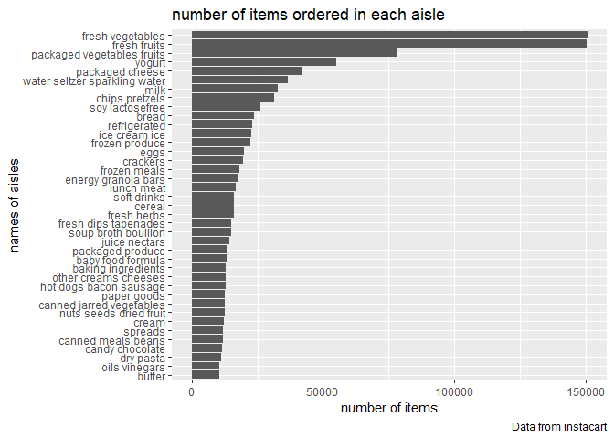
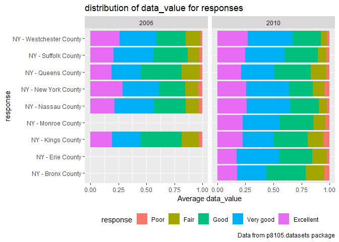

p8105\_hw3\_xl2851
================

# problem 1

## 1.1 How many aisles are there, and which aisles are the most items ordered from?

``` r
library(p8105.datasets)
library(tidyr)
library(tidyverse)
```

    ## -- Attaching packages ------------------------------------------ tidyverse 1.2.1 --

    ## v ggplot2 3.2.1     v purrr   0.3.2
    ## v tibble  2.1.3     v dplyr   0.8.3
    ## v readr   1.3.1     v stringr 1.4.0
    ## v ggplot2 3.2.1     v forcats 0.4.0

    ## -- Conflicts --------------------------------------------- tidyverse_conflicts() --
    ## x dplyr::filter() masks stats::filter()
    ## x dplyr::lag()    masks stats::lag()

``` r
data("instacart")
```

``` r
aisle_count=
instacart %>%
  group_by(aisle) %>%
  summarize(number_of_items=n())%>%
  arrange(desc(number_of_items))
```

There are 134 aisles. Fresh vegetables are the most items ordered
from.

## 1.2 Make a plot that shows the number of items ordered in each aisle, limiting this to aisles with more than 10000 items ordered.

``` r
plot_aisle =
  aisle_count %>%
  filter(number_of_items>10000)%>%
  ggplot(aes(x=number_of_items, y=aisle))

plot_aisle+geom_point()
```

<!-- -->

## 1.3 Make a table showing the three most popular items in each of the aisles

``` r
  instacart %>%
  filter(aisle == c("baking ingredients","dog food care","packaged vegetables fruits"))%>%
  group_by(aisle)%>%
  count(product_name, name="num_of_items")%>%
  arrange(desc(num_of_items))%>%
  top_n(3)%>%
  knitr::kable()
```

    ## Selecting by num_of_items

| aisle                      | product\_name                                   | num\_of\_items |
| :------------------------- | :---------------------------------------------- | -------------: |
| packaged vegetables fruits | Organic Baby Spinach                            |           3324 |
| packaged vegetables fruits | Organic Raspberries                             |           1920 |
| packaged vegetables fruits | Organic Blueberries                             |           1692 |
| baking ingredients         | Light Brown Sugar                               |            157 |
| baking ingredients         | Pure Baking Soda                                |            140 |
| baking ingredients         | Organic Vanilla Extract                         |            122 |
| dog food care              | Organix Grain Free Chicken & Vegetable Dog Food |             14 |
| dog food care              | Organix Chicken & Brown Rice Recipe             |             13 |
| dog food care              | Original Dry Dog                                |              9 |

## 1.4 Make a table showing the mean hour of the day at which Pink Lady Apples and Coffee Ice Cream are ordered on each day of the week

``` r
  instacart %>%
  filter(product_name==c("Pink Lady Apples","Coffee Ice Cream"))%>%
  group_by(order_dow)%>%
  summarize(
    mean=mean(order_hour_of_day)
  )%>%
  knitr::kable()
```

    ## Warning in product_name == c("Pink Lady Apples", "Coffee Ice Cream"):
    ## longer object length is not a multiple of shorter object length

| order\_dow |     mean |
| ---------: | -------: |
|          0 | 12.76471 |
|          1 | 12.67500 |
|          2 | 12.88235 |
|          3 | 14.50000 |
|          4 | 13.60870 |
|          5 | 12.87500 |
|          6 | 12.07692 |

There are 1384617 rows and 15 columns in data ‘instacart’. There are 134
distinct aisles. Some key variables include 131209 distinct order\_id
and 131209 distinct user\_id.

# problem 2

## clean the data

``` r
data("brfss_smart2010")
tidied_brfss=
  filter(brfss_smart2010,Topic=="Overall Health")%>%
  janitor::clean_names() %>%
  mutate(
    response=as.factor(response),
    response = forcats::fct_relevel(response, c("Poor","Fair","Good", "Very good","Excellent")))
```

## In 2002, which states were observed at 7 or more locations? What about in 2010?

``` r
  separate(tidied_brfss,locationdesc,c("state","county"))%>%
  group_by(state,year)%>%
  summarise(n_location=n_distinct(county))%>%
  filter(n_location>=7, year==2002)%>%
  knitr::kable()
```

    ## Warning: Expected 2 pieces. Additional pieces discarded in 10625 rows [1,
    ## 2, 3, 4, 5, 6, 7, 8, 9, 10, 11, 12, 13, 14, 15, 16, 17, 18, 19, 20, ...].

| state | year | n\_location |
| :---- | ---: | ----------: |
| FL    | 2002 |           7 |
| MA    | 2002 |           8 |
| NC    | 2002 |           7 |
| NJ    | 2002 |           8 |
| PA    | 2002 |          10 |

``` r
  separate(tidied_brfss,locationdesc,c("state","county"))%>%
  group_by(state,year)%>%
  summarise(n_location=n_distinct(county))%>%
  filter(n_location>=7, year==2010)%>%
  knitr::kable()
```

    ## Warning: Expected 2 pieces. Additional pieces discarded in 10625 rows [1,
    ## 2, 3, 4, 5, 6, 7, 8, 9, 10, 11, 12, 13, 14, 15, 16, 17, 18, 19, 20, ...].

| state | year | n\_location |
| :---- | ---: | ----------: |
| CA    | 2010 |           9 |
| CO    | 2010 |           7 |
| FL    | 2010 |          40 |
| MA    | 2010 |           9 |
| MD    | 2010 |          11 |
| NC    | 2010 |          12 |
| NE    | 2010 |          10 |
| NJ    | 2010 |          19 |
| NY    | 2010 |           9 |
| OH    | 2010 |           8 |
| PA    | 2010 |           7 |
| SC    | 2010 |           7 |
| TX    | 2010 |          16 |
| WA    | 2010 |          10 |

## Construct a dataset that is limited to Excellent responses, and contains, year, state, and a variable that averages the data\_value across locations within a state.

``` r
brfss_new =
  tidied_brfss %>% 
  filter(response == "Excellent") %>% 
  group_by(year, locationabbr) %>% 
  mutate(mean = mean(data_value, na.rm = FALSE)) %>%
  select(year, locationabbr, mean) %>% 
  distinct() 
```

## Make a “spaghetti” plot

``` r
ggplot(brfss_new, aes(x = year, y = mean, color = locationabbr, group = locationabbr))+
  geom_line() +
  theme(legend.position="none") +
  xlab("Year") +
  ylab("The average value within a state") +
  ggtitle("The average value over time within a state")
```

    ## Warning: Removed 3 rows containing missing values (geom_path).

<!-- -->

## two-panel plot

``` r
  tidied_brfss %>%
  filter(locationabbr=="NY",year %in% c(2006, 2010))%>%
  ggplot(aes(x = response, y = data_value )) +
  geom_boxplot(alpha = .5)+
  facet_grid(~year)+
  viridis::scale_fill_viridis(discrete = TRUE)
```

<!-- -->

# problem 3

``` r
accel_data=read_csv("./accel_data.csv")%>%
  pivot_longer(
    activity.1:activity.1440,
    names_to = "activity",
    values_to = "count"
  )
```

    ## Parsed with column specification:
    ## cols(
    ##   .default = col_double(),
    ##   day = col_character()
    ## )

    ## See spec(...) for full column specifications.
